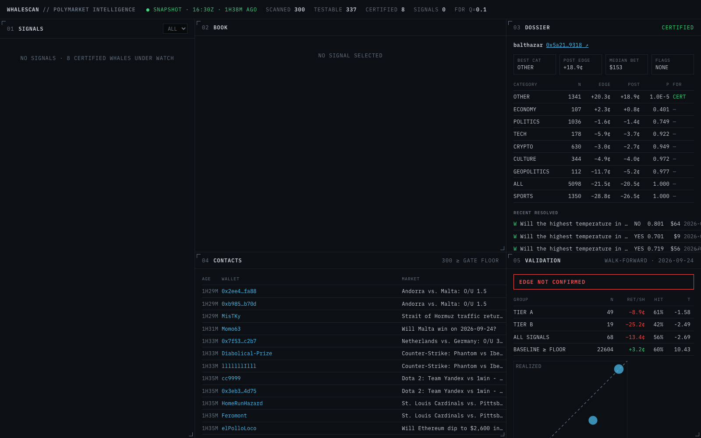
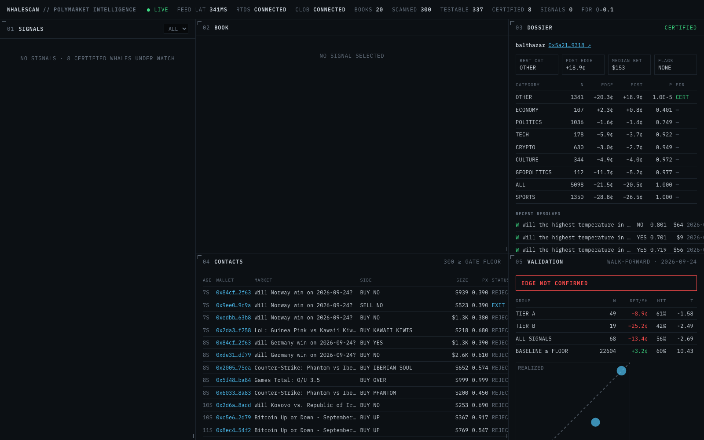

# WHALESCAN

**A statistically certified Polymarket whale scanner.** It finds wallets whose forecasting skill survives a
Monte Carlo significance test *and* a false-discovery-rate correction, watches their trades in real time, and
surfaces only the few that are still worth following after the real cost of entry. It then checks, out of
sample, whether following them would actually have made money. Humans decide; the tool never trades.

**Live dashboard:** https://ts7832.github.io/whalescan/ (rebuilt every 6 hours by GitHub Actions; €0 infrastructure)



## What it found

1. **Most "whale trackers" measure luck, because of how Polymarket reports history.**
   - `/closed-positions` sorts by profit by default, so a truncated history is all winners.
   - More subtly, losing bets pay $0, so nobody redeems them and they never appear there at all. They stay in
     `/positions` forever.
   - One top-leaderboard wallet showed a **97% win rate at average odds of 0.50** across 298 sports bets.
     Adding its 287 hidden losers ($6.2M staked) brings it to **49.6%**: no skill at all.
   - Fixing this cut the "certified whales" from 75 to 8 (out of 337 testable wallets).
2. **Real skill is narrow.** The top certified wallet is +18.9¢ per share over 1,341 weather markets
   (p ≈ 10⁻⁵), and loses money in every other category. That's why skill is certified per category.
3. **Following certified whales did not pay out of sample.** Across 92 two-week walk-forward folds, copying
   their gated signals returned **−13.4¢ per share (t = −2.7)**. The dashboard says so in red:
   `EDGE NOT CONFIRMED`.

## How it works

```
leaderboard + large trades ─▶ wallet universe (3,000)
closed positions ∪ unredeemed resolved positions, time-sorted, depth-windowed ─▶ DuckDB
resolved markets only (exactly 1/0) ─▶ edge = Σw(y − p) / Σw          (per wallet, per category)
C++ Monte Carlo, multithreaded: replay each record under "no skill" (y* ~ Bernoulli(p)) ─▶ p-value
Benjamini–Hochberg @ q = 0.10  +  empirical-Bayes shrinkage ─▶ certified whales + posterior edge
trades ─▶ position events ─▶ gates G1–G7 (C++ order-book walk for cost-to-follow, taker fees)
walk-forward backtest (no look-ahead) ─▶ EDGE CONFIRMED / NOT CONFIRMED
```

| Gate | Check |
|---|---|
| G1 | the whale is buying (sells show as EXIT) |
| G2 | the wallet is certified in this market's category (or overall, when the category is thin) |
| G3 | ≥ $5,000 and ≥ 2× the wallet's median bet |
| G4 | price in [0.05, 0.95] |
| G5 | known, non-bot, liquid market with ≥ 2 h to resolution |
| G6 | posterior edge − slippage (walking the book for $1,000) − fee ≥ 2¢ |
| G7 | no certified whale on the other side |

**Engineering highlights**
- **C++20 core via nanobind**, with the GIL released while it runs:
  - the Monte Carlo engine uses two passes (a 2k-simulation screen, then 100k where precision matters) and is
    deterministic whatever the thread count
  - the L2 order book stores integer ticks, applies batched updates, and computes microprice and VWAP walks
- **Async ingestion:** per-host token buckets set to measured rate limits, exponential backoff, and Cloudflare
  blocks detected and never retried.
- **Idempotent DuckDB storage,** with a single-writer lock that survives crashes.
- **Live station:** WebSocket feeds with heartbeats, silence detection, and backoff with jitter. Every book update
  is checked against the server's own best bid/ask, and the book is re-fetched over REST when they disagree.



## Run it

```bash
uv sync                                    # builds the C++ core (CMake + nanobind)
uv run whalescan score --max-wallets 300   # certified whale table
uv run whalescan batch                     # full pipeline -> data/snapshot/*.json
(cd web && npm install && npm run build)
uv run whalescan live                      # real-time station + dashboard on http://127.0.0.1:8765
```

Tests: `uv run pytest` (Python) · `scripts/test-cpp.sh` (C++/Catch2) · `cd web && npm test` (Vitest).
CI runs all three on every push.

Live mode subscribes to Polymarket's trade firehose (RTDS) and to the order books of every market a certified
whale bought in the last 24 hours (CLOB). It gates each trade the moment it prints and pushes contacts, signals
and book updates to the dashboard. A signal whose live cost-to-follow runs past its max entry turns **STALE**.
Measured load: about 1,100 book messages/s for 200 tokens, with feed latency of about 0.3–0.4 s.

If GitHub's runners are ever blocked by Polymarket, `uv run whalescan batch --publish` publishes from your own
machine instead.

## Layout

`cpp/` C++20 core · `src/whalescan/` Python pipeline, gate and live station · `web/` React/TypeScript
dashboard · `config.toml` every threshold · `docs/` design spec, implementation plans and API notes
(including every Polymarket quirk found along the way).

## Honest caveats

- The wallet universe is seeded from the *current* leaderboard, which leaks some future information into the
  choice of which wallets are studied.
- Positions exited before resolution are scored as if held to resolution.
- Validation models the follow cost as the whale's price plus 1.5¢, because historical order books weren't
  recorded. Wallet flags and stake caps use each wallet's full history.
- Snapshot signals can be hours old; the dashboard shows each book's age. Always re-check the price.
- Check Polymarket's terms for your jurisdiction before trading.
